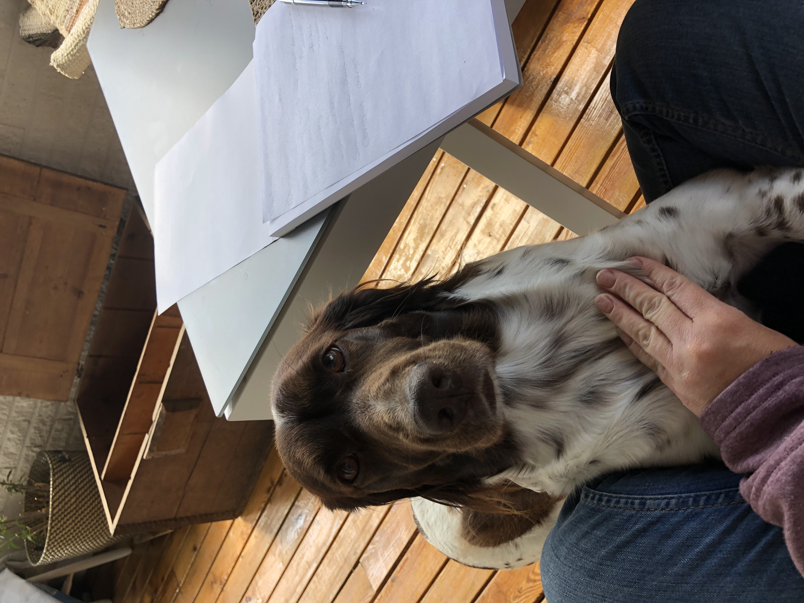
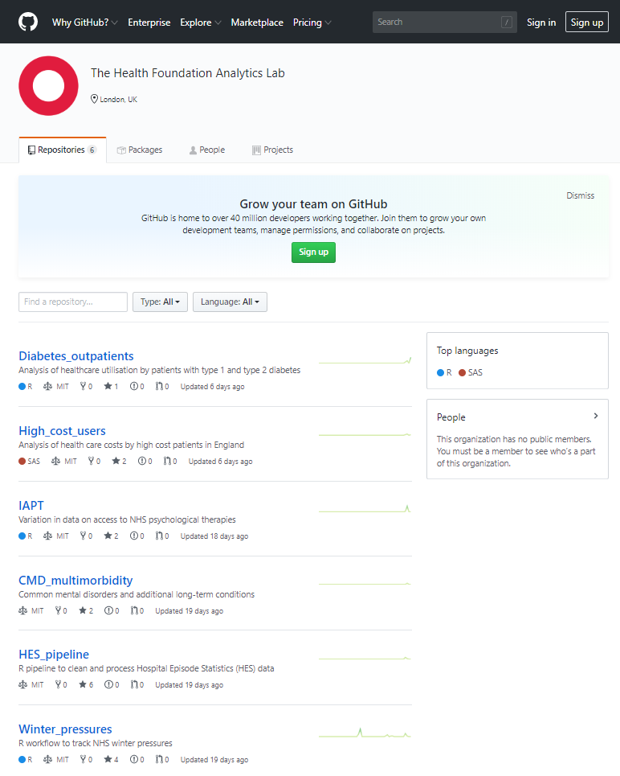
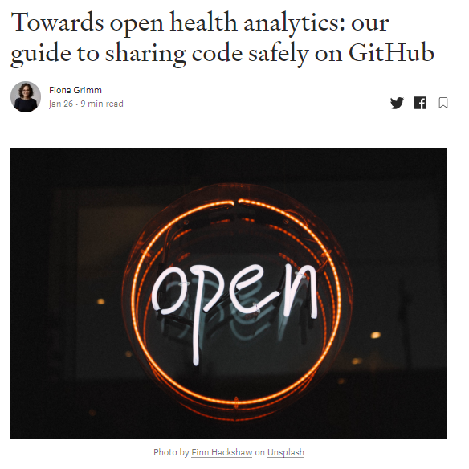
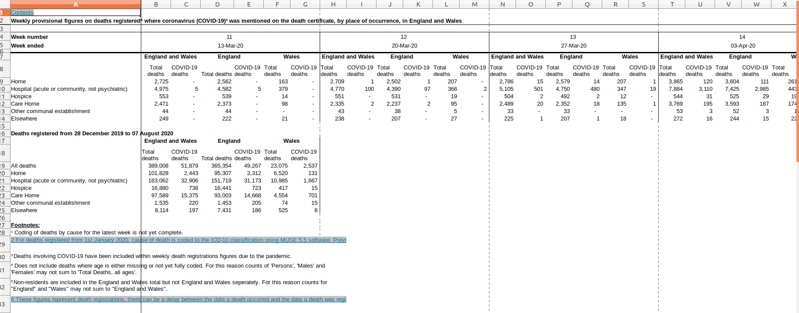

```{r setup, include=FALSE}
options(htmltools.dir.version = FALSE)
knitr::opts_chunk$set(eval =  FALSE)
library(monstR)
```

```{r xaringan-themer, include=FALSE, warning=FALSE}
library(xaringanthemer)
style_duo_accent(
  primary_color = "#DD0031",
  secondary_color = "#7EBFDA",
  inverse_header_color = "#744284",
)
```


## About me
Senior data analyst at the Health Foundation

Part-time PhD student at UCL Great Ormond Street Institute of Child Health

Organiser of R-ladies London

`#rdogladies`

 

---
class: middle 

.pull-left[


]

.pull-right[

The Health Foundation is an independent charity committed to bringing about better health and health care for people
in the UK.
We connect what works 
on the ground with
effective policymaking 
and vice versa.


]


---
class: inverse, middle, center

# Ensuring everyone’s health and care benefits from analytics and data-driven technology

---
# 

.pull-left[

 

]
.pull-right[
 
]


---

## Open analytics at the Health Foundation

.pull-left[
### Sharing our code
 

]

.pull-right[
### Sharing our learning
 

]
---
## How did COVID-19 change our ways of working?

- Working remotely
--

- Workload increased

--

- Work became more reactive - often responding to data releases the same day

--

- Outputs updated when new data became available

--

- Aiming to inform policy - vital to be transparent

--

Even more committed to being open but we need an open data pipeline to enable us to analyse data more quickly in a transparent and reproducible way.


---


# Open data pipeline

1. download publicly available data
1. clean the data
1. create charts and tables
<br>
--
<br/>
.pull-left[

]
.pull-right[

]

---

# Getting your hands on the data

--

<a href="https://imgflip.com/i/4cn4pw"></a><div><a href="https://imgflip.com/memegenerator">from Imgflip Meme Generator</a></div>

---
# Letting R do all the work
You can download the data directly from the internet without leaving RStudio.

`download.file()` from base R

`curl_download()` from the `curl` package


--

.pull-left[

]


.pull-right[
The link changes every time the data is updated 
]


---


# Scrape the link 
```{r, eval=FALSE}
link <- 'https://www.ons.gov.uk/peoplepopulationandcommunity/birthsdeathsandmarriages/deaths/datasets/weeklyprovisionalfiguresondeathsregisteredinenglandandwales'
bow(link)
page <- read_html(link)
links <- page %>% 
  html_nodes(css=".btn--thick") %>%
  html_attr('href')

file_names <- fs::path_file(links)

link_2020 <- links[stringr::str_detect(links, '2020.')]
name_2020 <- links[stringr::str_detect(file_names, '2020.')]
destfile_ONS <- here::here('data', 'original data', name_2020)
curl_download(paste0('https://www.ons.gov.uk/', link_2020), destfile = destfile_ONS)
```


--

Depends on structure of website so requires time setting up
---


 


--

- `clean_names()` and `remove_empty()` functions  from the `janitor` package

--

- skiping rows when reading in data and dropping certain rows `filter(row_number()<14, row_number()>=3) ` (risky, what if data changes next week)

--

- wrote unit tests using `testthat` package to warn us if data changes

---
# Clean up our pipeline
Working with Neale Swinnerton from [MastodonC](https://www.mastodonc.com/)


---
class: 
# The birth of monstR


 


---

# What is an API?

**My pre-monstR understanding** : I have no idea but if there is one then I should use it.

--

**Wikipedia definition** : An application programming interface (API) is a computing interface which defines interactions between multiple software intermediaries.

--

**My definition** : A bunch of json files that will eventually give me a link. 

Let's have a look!

https://api.beta.ons.gov.uk/v1/datasets

---
class: inverse, middle

#`monstR` makes navigating those files easier!

---
# Main functions

Only really 3 functions you need to worry about

- `available_datasets()`
- `available_editions()`
- `available_versions()` 

---

### Available data sets


```{r, eval=TRUE, echo=TRUE}
datasets <- ons_available_datasets()
```


```{r, eval=TRUE, echo=FALSE}
knitr::kable(datasets[1:5], format='html')
```

---

### Available editions
```{r, eval=TRUE, echo=TRUE}
ons_available_editions(id="weekly-deaths-region")

```

---
### Available versions
```{r, eval=TRUE, echo=TRUE}
ons_available_versions(id="weekly-deaths-region", edition='covid-19')
```
---

# Full pipeline - set-up

```{r}
monstr_pipeline_defaults() %>%  #<< 
  ons_datasets_setup() %>% #<< 
	ons_dataset_by_id("weekly-deaths-region") %>% #<< 
	ons_download(format="csv") %>%
	monstr_read_file() %>%  
	monstr_clean() %>%
	monstr_write_clean(format="all")
```


---

# Full pipeline - download

```{r}
monstr_pipeline_defaults() %>%  
  ons_datasets_setup() %>% 
	ons_dataset_by_id("weekly-deaths-region") %>%  
	ons_download(format="csv") %>% #<< 
	monstr_read_file() %>%  
	monstr_clean() %>%
	monstr_write_clean(format="all")
```

---

# Full pipeline - cleaning

```{r}
monstr_pipeline_defaults() %>%  
  ons_datasets_setup() %>% 
	ons_dataset_by_id("weekly-deaths-region") %>%  
	ons_download(format="csv") %>% 
	monstr_read_file() %>%  #<< 
	monstr_clean() %>% #<< 
	monstr_write_clean(format="all") #<< 
```


---

# What did we learn building our first package?

- `usethis` package makes package building easy
- `packagedown`package makes it incredibly easy to set up a website!
- github actions let's you automate the boring bits (and you get badges for your readme!)


---
# What's next

- improve documentation

--

- add units tests

--

- work with the ONS team

--

- build into our data pipeline


---
## Please try monstR

- download the package

- let's us know what works and what doesn't

- suggest new features


https://github.com/HFAnalyticsLab/monstR

 

---

class: middle

# Thanks!

All of contributors can be found on our github page
- Neale Swinnerton - wrote most of the code
- Fiona Grimm - designed the logo
- Richard Brine - came up with the name


